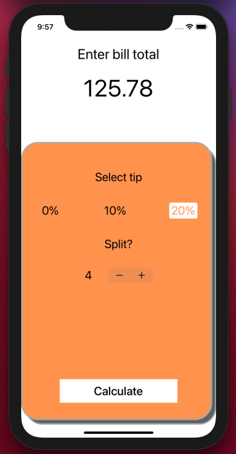
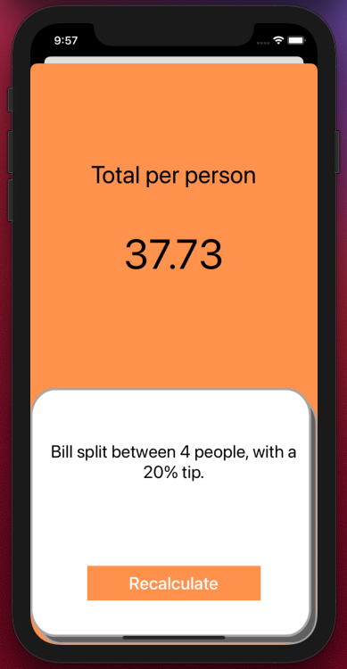

# Tipsy
Bill sharing app written in Swift using UIKit and Storyboards.

I enjoyed getting used to passing data between Views and becoming more familiar with Xcode and Swift. 
Simple bill sharing app made to help customers split that bill equally without fuss. 

## To Run App - 

1. Hit the green 'Code' button on this repo and copy the link to clone project
2. Load up xcode.
3. Under Source Control, click 'Clone'
4. Paste link into window and click 'Clone'
5. Navigate to where project is to be saved
6. Once opened, Run project and play!

### UI Design

### Gameplay

